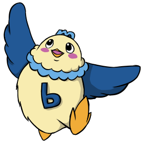
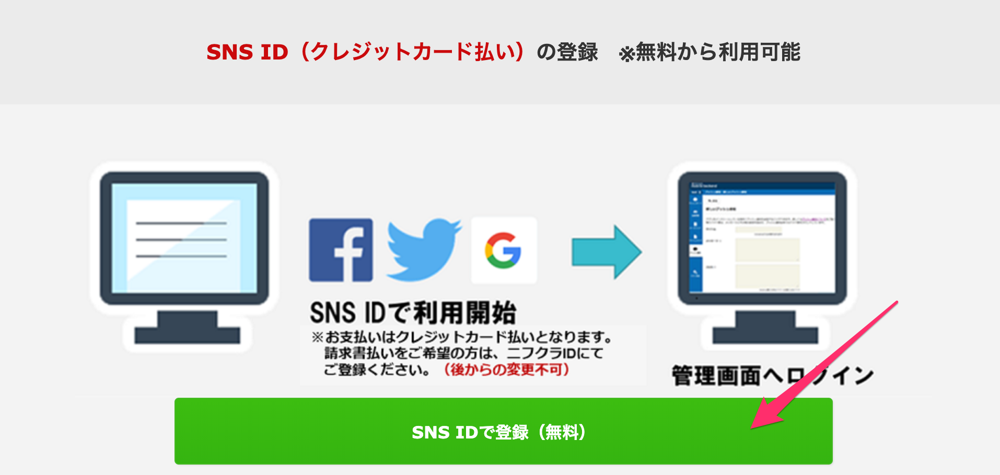
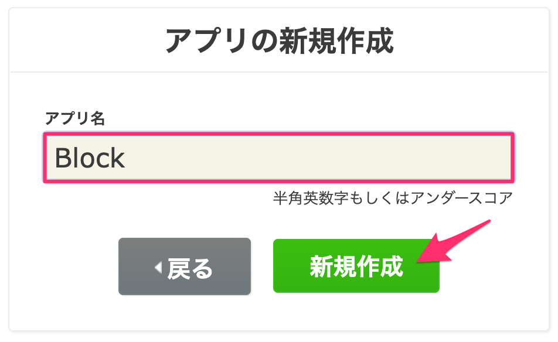
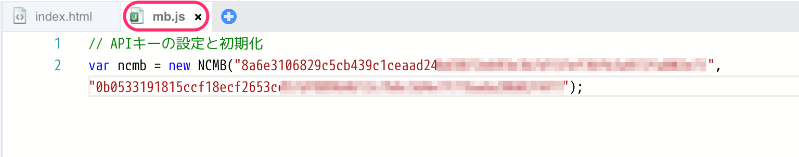
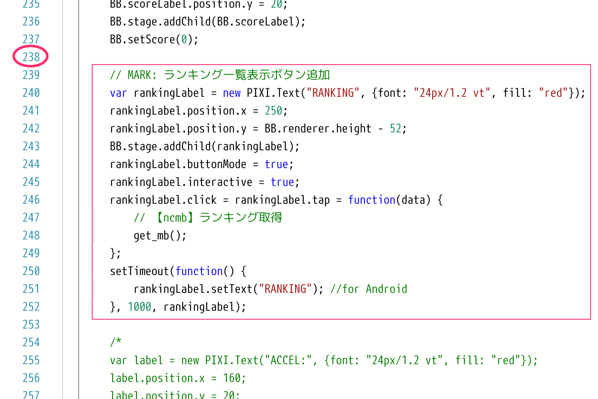
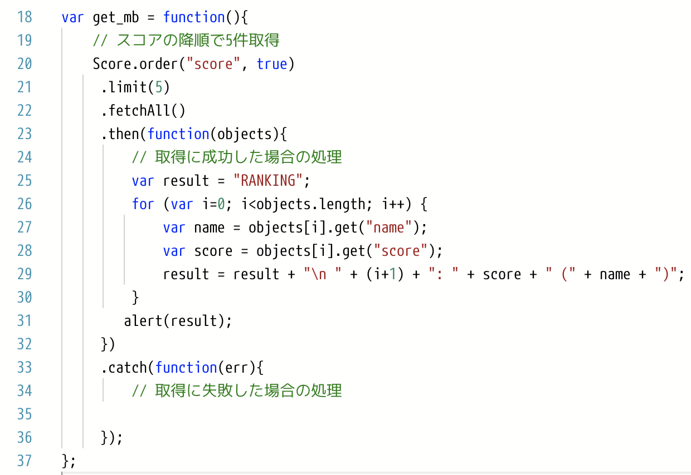
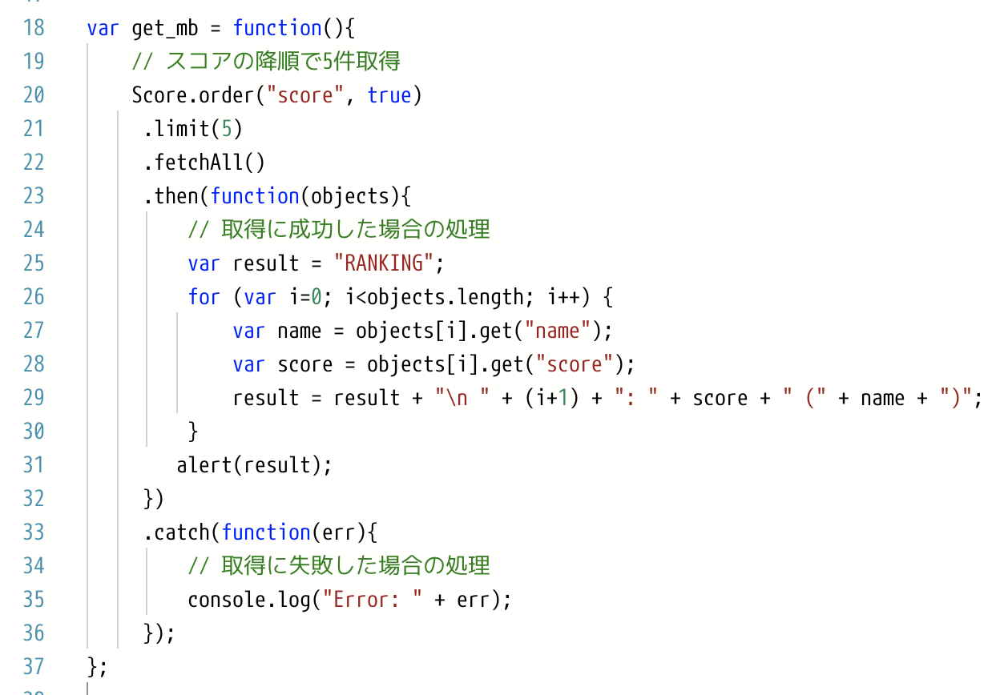
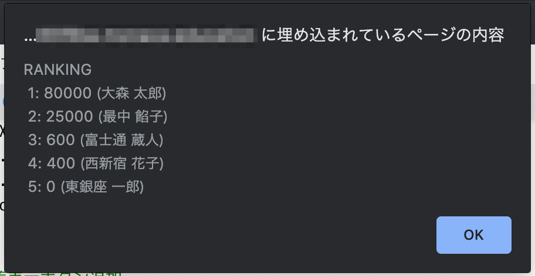

title: How to オンラインランキング
class: animation-fade
layout: true

<!-- This slide will serve as the base layout for all your slides -->
.bottom-bar[
  {{title}}
]

---

class: impact

# {{title}}
## 50分でクラウドマスター for Monaca


.right[]

.footnote[
.left[
.size_small_7[
Copyright 2019 FUJITSU CLOUD TECHNOLOGIES LIMITED<br>
Created by Natsumo Ikeda
]
]
]

---
title: はじめに
layout: true
class: center, middle, animation-fade

---
# {{title}}

---
title: はじめに
layout: false

# 資料

.size_large_18[
__<a href="http://bit.ly/MakeOnlineRanking" target="_blank">MakeOnlineRanking ↗️</a>__
]
.size_small_9[
`http://bit.ly/MakeOnlineRanking`
]

### ダウンロード方法
.size_small_7[
* Google Chrome でURLを開く
* 「設定」＞「印刷」＞送信先で「PDFに保存」を選択する
* プレビュー画面で画像が全て読み込まれたことを確認して「保存」をクリック
]

.bottom-bar[
  {{title}}
]

---
title: はじめに

# 取り組むこと
## オンラインランキング機能を実装しましょう

.col-8[
.size_small_9[
.color_pink[__Monaca__] のサンプルプロジェクト「ブロック崩し」にオンラインランキング機能を追加します。オンラインランキング機能部分は１から全て実装します。50分でクラウドをマスターしましょう。
]
.size_small_7[
* ゼロベースからあっという間にランキング機能を追加できます
* ランキング機能は高速で実装できてしまうことがよくわかります
]
]
.col-4[
.center[]
]

.bottom-bar[
  {{title}}
]

---
title: はじめに

# 使うもの
## クラウドアプリ開発環境「Monaca」

.size_small_7[
HTML5 / JavaScript / CSS3 で iOS, Android 両OSのスマートフォンアプリが同時に開発できるクラウド開発環境です。オンラインランキングを実装する開発中のアプリがあればそれに組み込むのが一番！ですが開発中のゲームアプリが特に無く、とりあえず使い勝手を試したいのであればサンプルゲームがあって取り組みやすい __Monaca__ がおすすめです👌
]

.col-6[
.center[]
]

.col-6[
.size_small_7[
* .color_pink[__ニフクラ mobile backend__] との連携が圧倒的に楽
* __環境構築不要__ （ブラウザで開発）
* 学びやすい __スクリプト言語__
* しかも .alt-bg[__無料__] から使える
]
]

.bottom-bar[
  {{title}}
]

---
title: はじめに

# 使うもの
## クラウドデータベース「ニフクラ mobile backend」

.size_small_7[
ランキングを作成してそれを __オンライン化__ するために必要なのが「 __クラウドデータベース__ 」です。一般にデータベースを自前で１から開発・・・となるとかなり大変ですが、 __構築不要ですぐに使えるクラウドデータベース__ である __ニフクラ mobile backend__ を活用すればあっという間に実装することができます👌
]

.col-6[
.center[]
]

.col-6[
.size_small_7[
* .color_pink[__Monaca__] との連携が圧倒的に楽
* __環境構築不要__ （ブラウザから管理できる）
* SDKはなんと５種類
  * .size_small_7[JavaScript/iOS(Swift/objective-C)/Android(Java)/Unity(C#)]
* しかも .alt-bg[__無料__] から使える
]
]

.bottom-bar[
  {{title}}
]

---
title: はじめに

# 作るもの
## オンラインランキング機能付きブロック崩し
.col-4[
.size_small_9[
「オンラインランキング機能付きブロック崩し」アプリを作ります。
]
]
.col-8[
.center[]
]
.bottom-bar[
  {{title}}
]


---
title: はじめに

# 作り方・作業手順

.size_small_7[
1. Monacaのアカウントを作成する
1. 「ブロック崩し」プロジェクトを作る
1. ニフクラ mobile backend のアカウントを作成する
1. プロジェクトとクラウドを連携する
  1. ニフクラ mobile backend にアプリを作成する
  1. Monaca に mobile backend のSDKを導入する
  1. SDKを初期化する
1. 機能実装①：ゲームスコアを保存する
1. ①の動作確認
1. 機能実装②：ランキングを取得する
1. ②の動作確認
]

.bottom-bar[
  {{title}}
]

---
title: 1.&nbsp;Monacaのアカウントを作成する
layout: true
class: center, middle, animation-fade

---
# {{title}}

---
title: 1.&nbsp;Monacaのアカウントを作成する
layout: false

.col-8[
.size_small_7[
* Monaca Education を開く
* 「アカウント作成」をクリックする
]

.center[]

.size_small_7[
__<a href="https://edu.monaca.io/" target="_blank">Monaca Education トップページ ↗️</a>__<br>
`https://edu.monaca.io/`
]
]
.col-4[
<br><br>
.size_small_7[
✅__既にアカウントをお持ちの方__
* 通常版 Monaca アカウント
* Monaca Education アカウント
]
.size_small_5[
そのままご利用ください。上記どちらでもOKです。<br>
ただし、本資料は Monaca Education アカウントを使った前提で操作説明を記述しています。通常版をご利用の場合は多少操作手順が異なる場合がございます。
]
]
.size_small_7[
✅Monaca利用時、ブラウザは必ず __Google Chrome__ を使用してください
]


.bottom-bar[
  {{title}}
]

---
title: 1.&nbsp;Monacaのアカウントを作成する

.col-6[
.size_small_7[
* 「メールアドレス」と「パスワード」を入力する
* 「アカウント新規作成」をクリックする
]
.center[]
]

.col-6[
.size_small_7[
* 入力した「メールアドレス」に確認メールが届く
]
<br>
.center[]
]
.bottom-bar[
  {{title}}
]

---
title: 1.&nbsp;Monacaのアカウントを作成する

.col-6[
.size_small_7[
* ブラウザの別タブを開き、メールを確する
* メール本文にある「本登録はこちら」をクリックする
]
.center[]
]

.col-6[
.size_small_7[
* 「利用プラン選択」＞「Freeプラン」を選択する
* 「お名前」を入力して「次に進む」をクリックする

]
.center[]
]
.bottom-bar[
  {{title}}
]

---
title: 1.&nbsp;Monacaのアカウントを作成する

.col-6[
.size_small_7[
* 「OK」をクリックする
]
.center[]
]

.col-6[
.size_small_7[
* 「ダッシュボードに進む」をクリックする

]
.center[]
]
.bottom-bar[
  {{title}}
]

---
title: 1.&nbsp;Monacaのアカウントを作成する

.col-5[
.size_small_7[
* 「同意する」をクリックする
]
.center[]
]

.col-7[
.size_small_7[
* ダッシュボードが表示される

]
.center[]
]

.right_under[
.size_small_7[
✅これでアカウント作成とログインが完了しました
]
]
.bottom-bar[
  {{title}}
]

---
title: 2.&nbsp;「ブロック崩し」プロジェクトを作る
layout: true
class: center, middle, animation-fade

---
# {{title}}

---
title: 2.&nbsp;「ブロック崩し」プロジェクトを作る
layout: false

.col-6[
.size_small_7[
* 「新しいプロジェクトを作る」をクリックする
]
.center[]
]

.col-6[
.size_small_7[
* 「テンプレート」＞「ブロック崩し」を選択する

]
.center[]
]
.bottom-bar[
  {{title}}
]

---
title: 2.&nbsp;「ブロック崩し」プロジェクトを作る

.col-6[
.size_small_7[
* 「プロジェクトの情報」はそのままで「作成」をクリックする
]
.center[]
]

.col-6[
.size_small_7[
* プロジェクトが作成される

]
.center[]
]
.bottom-bar[
  {{title}}
]

---
title: 2.&nbsp;「ブロック崩し」プロジェクトを作る


.size_small_7[
* 作成されたプロジェクトを選択する
* 「クラウドIDEで開く」をクリックする
]
.center[]

.bottom-bar[
  {{title}}
]

---
title: 2.&nbsp;「ブロック崩し」プロジェクトを作る


.size_small_7[
* プロジェクトが開かれる
]
.center[]

.bottom-bar[
  {{title}}
]

.right_under[
.size_small_7[
✅これでMonaca側の準備は整いました。続いて ニフクラ mobile backend 側の準備をしていきます。
]
]

---
title: 3.&nbsp;ニフクラ mobile backend のアカウントを作成する
layout: true
class: center, middle, animation-fade

---
# {{title}}

---
title: 3.&nbsp;ニフクラ mobile backend のアカウントを作成する
layout: false

.col-9[
.size_small_7[
* ニフクラ mobile backend を開く
* 「無料登録」をクリックする
]
.center[]
<br>
.size_small_7[
__<a href="https://mbaas.nifcloud.com/" target="_blank">ニフクラ mobile backend トップページ ↗️</a>__<br>
`https://mbaas.nifcloud.com/`
]
]
.col-3[
<br><br>
.size_small_7[
✅__既にアカウントをお持ちの方__
]
.size_small_5[
「ログイン」からご利用ください。
]
]

.bottom-bar[
  {{title}}
]

---
title: 3.&nbsp;ニフクラ mobile backend のアカウントを作成する

.col-6[
.size_small_7[
* 「SNS ID で登録（無料）」をクリックする
]
.center[]
]
.col-6[
.size_small_7[
* アカウントを持っているいずれかのSNS アカウント（Facebook/Twitter/Google）をクリックする
]
.center[]
]
.bottom-bar[
  {{title}}
]

---
title: 3.&nbsp;ニフクラ mobile backend のアカウントを作成する

.col-6[
.size_small_7[
* 各アカウントの認証画面に遷移する（画面が異なります）
  * 各アカウントのID/PW情報を入力する
  * 認証が完了すると次の画面に遷移する
* 「確認メールを送信」をクリックする
  * 各アカウントに紐づいたメールアドレスが表示される
]
.center[]
.size_small_5[
<br>
✅メールアドレスは任意で変更可能です。
]
]
.col-6[
.size_small_7[
* 一つ前の画面で確認したメールアドレスに確認メールが届く
]
.center[]
]
.bottom-bar[
  {{title}}
]

---
title: 3.&nbsp;ニフクラ mobile backend のアカウントを作成する

.col-6[
.size_small_7[
* ブラウザの別タブを開き、メールを確認する
* メール本文にあるURLをクリックする
]
.center[]

]
.col-6[
.size_small_7[
* 規約（２種類）を確認後「以上の規約に同意する」にチェックを入れる
* 「アカウント登録」をクリックする
]
.center[]
]
.bottom-bar[
  {{title}}
]

---
title: 3.&nbsp;ニフクラ mobile backend のアカウントを作成する

.size_small_7[
* 「アプリの新規作成」画面が表示される
]
.center[]

.right_under[
.size_small_7[
✅ニフクラ mobile backend のアカウントが作成されました
]
]

.bottom-bar[
  {{title}}
]

---
title: 3.&nbsp;ニフクラ mobile backend のアカウントを作成する

## 参考
.size_small_7[
ブラウザに複数のタブが作られてしまっている場合は以下３つを残してそれ以外のタブは閉じておきましょう。

.col-4[
* 本資料
* Monaca プロジェクト画面
* ニフクラ mobile backend アプリの新規作成画面
]
]
.col-8[
.center[]
]

.bottom-bar[
  {{title}}
]

---
title: 4.&nbsp;プロジェクトとクラウドを連携する
layout: true
class: center, middle, animation-fade

---
# {{title}}

---
title: 4.&nbsp;プロジェクトとクラウドを連携する
layout: false

## 4.1. ニフクラ mobile backend にアプリを作成する

.col-7[
.size_small_7[
* ニフクラ mobile backend の「アプリの新規作成」画面を開く
* 「アプリ名」に `Block` と入力して「新規作成」をクリックする
]

.center[]
]

.col-5[
.size_small_7[
✅__既存アプリが存在する場合__
]
.size_small_5[
* 左上の「＋新しいアプリ」をクリックすると同じ画面が表示されます
]
.center[]
]


.bottom-bar[
  {{title}}
]

---
title: 4.&nbsp;プロジェクトとクラウドを連携する

## 4.1. ニフクラ mobile backend にアプリを作成する

.col-8[
.size_small_7[
クラウド上にアプリが作成され、 __APIキー__ が発行されます。

* 確認したら「OK」ボタンをクリックする
]
.center[]
]
.col-4[
.size_small_7[
✅__APIキーとは__<br>
]
.size_small_5[
Monacaで作成するアプリとニフクラ mobile backend（クラウド）とを連携するための鍵。アプリケーションキーとクライアントキーの２種類からなる。
]
.size_small_7[
* アプリケーションキー
  * アプリを特定するためのキー
* クライアントキー
  * 認証キー
]
]
.bottom-bar[
  {{title}}
]

---
title: 4.&nbsp;プロジェクトとクラウドを連携する

## 4.1. ニフクラ mobile backend にアプリを作成する

.size_small_7[
* ダッシュボードが表示される
]
.center[]
.right_under[
.size_small_7[
✅ダッシュボードは ニフクラ mobile backend の利用状況を確認できる画面です。
]
]
.bottom-bar[
  {{title}}
]

---
title: 4.&nbsp;プロジェクトとクラウドを連携する

## 4.1. ニフクラ mobile backend にアプリを作成する

.col-8[
.size_small_7[
これから使用するクラウドデータベースの場所を確認しておきましょう。

* 「データストア」をクリックする

]
.center[]
]
.col-4[
.size_small_7[
✅デフォルトクラス：
]
.size_small_5[
* `installation`
  * プッシュ通知配信端末情報が格納されるクラス
* `role`
  * 会員管理で設定した会員グループが格納されるクラス
]
]
.bottom-bar[
  {{title}}
]

---
title: 4.&nbsp;プロジェクトとクラウドを連携する

## 4.2. Monaca に mobile backend のSDKを導入する

.size_small_7[
Monaca からクラウドを簡単なコードで利用できるようにするために __SDK__ を導入します。
]
.col-4[
.size_small_7[
* Monaca のプロジェクト画面を開く
* 「設定」＞「JS/CSSコンポーネントの追加と削除」をクリックする

]
.center[]
]
.col-8[
.size_small_7[
* 「コンポーネント名」の検索窓に `ncmb` と入力して「検索する」ボタンをクリックする
]
.center[]
]
.right_under[
.size_small_5[
✅__SDKとは__
Software Development Kit。開発に必要なプログラムや技術文書などをひとまとめにしたも。
]
]

.bottom-bar[
  {{title}}
]

---
title: 4.&nbsp;プロジェクトとクラウドを連携する

## 4.2. Monaca に mobile backend のSDKを導入する

.col-6[
.size_small_7[
* 「ncmb」が表示されるので「追加」をクリックする

]
.center[]
]
.col-6[
.size_small_7[
* バージョンはそのまま（最新）の状態で「インストール」をクリックする
]
.center[]
]
.bottom-bar[
  {{title}}
]

---
title: 4.&nbsp;プロジェクトとクラウドを連携する

## 4.2. Monaca に mobile backend のSDKを導入する

.col-6[
.size_small_7[
* 「components/ncmb/ncmb.min.js」にチェックを入れる
* 「保存」をクリックする

]
.center[]
]
.col-6[
.size_small_7[
* 一覧に表示されたことを確認する
* 設定タブを閉じる
]
.center[]
]
.bottom-bar[
  {{title}}
]

---
title: 4.&nbsp;プロジェクトとクラウドを連携する

## 4.3. SDKを初期化する

.size_small_7[
導入したSDKを使える状態にしていきます。まずは JavaScript を書くためのファイルを用意します。
]

.col-6[
.size_small_7[
* Monaca のプロジェクト画面左側にある「js」フォルダを確認する
]
.center[]
]
.col-6[
.size_small_7[
* 「js」フォルダ上で __右クリック__ する
* 「新規ファイル作成」をクリックする
]
.center[]
]
.bottom-bar[
  {{title}}
]

---
title: 4.&nbsp;プロジェクトとクラウドを連携する

## 4.3. SDKを初期化する

.col-6[
.size_small_7[
* ファイル名に `mb.js` と入力して「OK」をクリックする
]
.center[]
]

.col-6[
.size_small_7[
* 「js」フォルダの「▶︎」をクリックする
*  「mb.js」ファイルをダブルクリックして開く
]
.center[]
]
.bottom-bar[
  {{title}}
]

---
title: 4.&nbsp;プロジェクトとクラウドを連携する

## 4.3. SDKを初期化する

.size_small_7[
次に js/mb.js にコードを書いていきます。
]
.center[]

.bottom-bar[
  {{title}}
]

---
title: 4.&nbsp;プロジェクトとクラウドを連携する

## 4.3. SDKを初期化する

.size_small_7[
* デフォルトで記入されているコメントを削除して次のコードを入力する

```js
// APIキーの設定と初期化
var ncmb = new NCMB("YOUR_APPLICATIONKEY","YOUR_CLIENTKEY");
```

]
<br><br>

.center[]

.bottom-bar[
  {{title}}
]

---
title: 4.&nbsp;プロジェクトとクラウドを連携する

## 4.3. SDKを初期化する

.size_small_7[
* 文字列部分は ニフクラ mobile backend のアプリ作成時に発行された __APIキー__ にそれぞれ書き換える
  * `YOUR_APPLICATIONKEY`
  * `YOUR_CLIENTKEY`
]
.center[]

.col-5[
.size_small_5[
✅__APIキーの確認方法__<br>
ニフクラ mobile backend 管理画面の右上にある「設定」から確認できます。「コピー」ボタンでコピーして利用してください。
]
]
.col-7[
.center[]
]
.bottom-bar[
  {{title}}
]

---
title: 4.&nbsp;プロジェクトとクラウドを連携する

## 4.3. SDKを初期化する

.col-9[
.size_small_7[
ファイルを更新したら必ずプロジェクトの保存をしましょう。
* 左上の保存ボタンをクリックする
]
.center[]
.size_small_7[
保存されるとファイル名の横にある「\*」が消えます。
]
.center[]
]

.col-3[
.size_small_7[
✅コマンドでも保存できます
]
.size_small_5[
* Windowsの場合： Ctrl + s
* Macの場合： Command + s
]
]

.bottom-bar[
  {{title}}
]

---
title: 4.&nbsp;プロジェクトとクラウドを連携する

## 4.3. SDKを初期化する

.size_small_7[
最後に js/mb.js をプロジェクトに認識させましょう。
* index.html を開く
  * タブをクリックする
]
.center[]
.bottom-bar[
  {{title}}
]

---
title: 4.&nbsp;プロジェクトとクラウドを連携する

## 4.3. SDKを初期化する

.size_small_7[
* 11行目の下（12行目）に次のコードを入力する
* 編集が終わったらメニューバーにある「保存」ボタンをクリックして保存する

```html
<script src="js/mb.js"></script>
```
]
.center[]
.right_under[
.size_small_7[
✅これで Monaca と ニフクラ mobile backend の連携は完了です。
]
]
.bottom-bar[
  {{title}}
]

---
title: 5.&nbsp;機能実装①：ゲームスコアを保存する
layout: true
class: center, middle, animation-fade

---
# {{title}}

---
title: 5.&nbsp;機能実装①：ゲームスコアを保存する
layout: false

### サンプルプロジェクト「ブロック崩し」

.col-8[
.size_small_7[
「ブロック崩し」は __起動と同時にゲームが開始される__ 仕様です。このままでもゲームを遊ぶことができます。

* ボールをバーで弾いてブロックに当てるとブロックを消すことができます
* ブロックを消すと点数（SCORE）が増えます
* ブロックの色によって点数が異なります
* 全部消すとゲームクリアです
* クリアする前にボールを落とすとゲームオーバーです
* 「RESET」ボタンを押すともう一度遊ぶことができます
]
]
.col-4[
<br>
.center[]
]

.bottom-bar[
  {{title}}
]

---
title: 5.&nbsp;機能実装①：ゲームスコアを保存する

### 実装内容

.size_small_7[
1. ゲーム終了時（クリアまたはゲームオーバー）に __プロンプトを表示__ してユーザー名を入力できるようにする
1. __ユーザー名とゲームスコアを ニフクラ mobile backend （クラウド）に保存__ する
]
.center[]
.bottom-bar[
  {{title}}
]

---
title: 5.&nbsp;機能実装①：ゲームスコアを保存する

.col-4[
.size_small_7[
* ゲームの処理内容が記載されている「js/main.js」をダブルクリックして開く
]
.center[]
]
.col-8[
.size_small_7[
* __267行目__ 以降を確認する

```js
  // Game Over        
  endGame: function() {
      BB.gameState = GAMESTATE_STOP;
      vibrate();
  },

  // Game Clear
  clearGame: function() {
      if(typeof navigator.notification !== 'undefined') navigator.notification.alert("Cleared!", function(){}, "Congraturations");
      else alert("Cleared!");

      BB.gameState = GAMESTATE_STOP;
  }
```

* `endGame` : ゲームオーバー（途中でボールを落として終了）処理メソッド
* `clearGame` : ゲームクリア（すべてのブロックを消して終了）処理メソッド
]
]
.bottom-bar[
  {{title}}
]

---
title: 5.&nbsp;機能実装①：ゲームスコアを保存する

.col-5[
.size_small_7[
* それぞれメソッド内の一番最後に __保存処理実装予定の `save_mb` メソッド__ を記述する
  * `save_mb` メソッドには引数としてスコアデータ（`BB.score`）を渡す

```js
// MARK: 【ncmb】ランキング登録
save_mb(BB.score);
```

* 編集が終わったらメニューバーにある「保存」ボタンをクリックして保存する
]
]
.col-7[
<br><br>
.center[]
]

.right_under[
.size_small_5[
✅長いコードの何処に追記したかを探しやすいように「`// MARK:`」のような見出しを付けておくと検索ですぐに探せるので便利です◎
]
]

.bottom-bar[
  {{title}}
]

---
title: 5.&nbsp;機能実装①：ゲームスコアを保存する

.col-8[
.size_small_7[
`save_mb` メソッドを実装します。
<br><br>

* js/mb.js を開く
* `SDKの初期化` コードを書いた下に続けてメソッドを実装する

```js
var save_mb = function(score){
    // ここに処理を書きます

};
```

<br><br>
* `save_mb` メソッド内にユーザー名を取得するためのプロンプトを実装する
  * プロンプトで入力した値が変数 `name` として取得される

```js
// ユーザー名取得
var name = prompt("Please write your name.");
```
]
]
.col-4[
.center[]
<br><br><br><br>
.center[]
]
.bottom-bar[
  {{title}}
]

---
title: 5.&nbsp;機能実装①：ゲームスコアを保存する

.col-8[
.size_small_7[
* 続けて、クラウドへの保存処理を実装する
  * ユーザー名（ `name` ）とスコアデータ（引数の `score` ）を保存

```js
// 保存先クラスの生成
var Score = ncmb.DataStore("Score");
// インスタンスを生成してデータを設定・保存
new Score().set("name", name)
           .set("score", score)
           .save();
```

* コードを確認する
   * `ncmb.DataStore(CLASSNAME)` : 新規クラスの生成or既存クラスの指定
      * CLASSNAME : クラス名
   * `set(KEY,VALUE)` : 値の設定
      * KEY : フィールド名
      * VALUE : 値
   * `save()` : 保存処理
]
]
.col-4[
.center[]
]
.right_under[
.size_small_7[
✅クラウドへのデータの保存処理はたったこれだけなんです🤩
]
]

.bottom-bar[
  {{title}}
]

---
title: 6.&nbsp;①の動作確認
layout: true
class: center, middle, animation-fade

---
# {{title}}

---
title: 6.&nbsp;①の動作確認
layout: false

.size_small_7[
Monaca のプレビュー画面を使って動作確認をします。

* プロジェクトを保存するかプレビュー画面右上にあるリロードボタンをクリックしてゲームを開始する
* バーを動かしブロックを崩して得点を稼ぐ
* クリアまたはゲームオーバーになるとプロンプトが表示される
* ユーザー名（なんでも）を入力して「OK」をクリックする
]

.center[]

.bottom-bar[
  {{title}}
]

---
title: 6.&nbsp;①の動作確認

.size_small_7[
プレビュー画面に変化はありませんが、クラウド側にデータの保存ができています。ニフクラ mobile backend を確認しましょう。

* ニフクラ mobile backend の管理画面から「データストア」を開く
* データストアに新しく「__Score__」クラスが作成されていることを確認する
* 「__Score__」クラスをクリックするとデータが格納されていることを確認する

]
.center[]
<br>
.col-2[
.size_small_5[
✅データ型アイコンが非表示の場合は、右上のボタンで表示することができます👌<br>
]
]
.col-2[
.center[]
]
.col-6[
.size_small_5[
✅ブロック崩しアプリの特性上、更新したファイルを保存した時点でゲームが開始されてしまうため、予期しないデータを保存してしまうことがあると思います。不要なデータが保存されてしまったら、データの左側にあるチェックボックスにチェックを入れると、「削除」ボタンが活性化されます。「削除」ボタンをクリックするとチェックを入れたデータを削除できます。
]
]
.col-2[
.center[]
]


.bottom-bar[
  {{title}}
]

---
title: 7.&nbsp;機能実装②：ランキングを取得する
layout: true
class: center, middle, animation-fade

---
# {{title}}

---
title: 7.&nbsp;機能実装②：ランキングを取得する
layout: false

### 実装内容

.size_small_7[
1. __「RANKING」ボタンを作成__ する
1. 「RANKING」ボタンをクリックすると __スコア（score）の上位5件を ニフクラ mobile backend （クラウド）から取得__ してアラートに表示する
]
.center[]
.right_under[
.size_small_5[
✅ランキングに表示するために何回かゲームをプレイしておきましょう。アプリ左下の「RESET」ボタンをクリックするとゲームが再スタートできます。
]
]
.bottom-bar[
  {{title}}
]

---
title: 7.&nbsp;機能実装②：ランキングを取得する

.col-8[
.size_small_7[
「RANKING」ボタンを用意します。

* js/main.js を開く
* __238行目__ に次の内容を実装する
  * アプリの右下に「RANKING」ボタンの生成
  * 「RANKING」ボタンのクリックイベント： これから実装する取得処理メソッド __`get_mb()`__
]
.size_small_5[

```js
// MARK: ランキング一覧表示ボタン追加
var rankingLabel = new PIXI.Text("RANKING", {font: "24px/1.2 vt", fill: "red"});
rankingLabel.position.x = 250;
rankingLabel.position.y = BB.renderer.height - 52;
BB.stage.addChild(rankingLabel);
rankingLabel.buttonMode = true;
rankingLabel.interactive = true;
rankingLabel.click = rankingLabel.tap = function(data) {
    // 【ncmb】ランキング取得
    get_mb();
};
setTimeout(function() {
    rankingLabel.setText("RANKING"); //for Android
}, 1000, rankingLabel);
```
]
.size_small_7[
* 編集が終わったらメニューバーにある「保存」ボタンをクリックして保存する
]
]
.col-4[
.center[]
<br><br><br>
.center[]
]
.bottom-bar[
  {{title}}
]

---
title: 7.&nbsp;機能実装②：ランキングを取得する

.col-8[
.size_small_7[
`get_mb()` を実装する前に１つ準備をします。<br>
`save_mb` メソッドでデータを保存した時と __同じクラスからデータを取得したい__ ので、 .alt-bg[クラスの生成コード] を `save_mb` メソッドの外に出してグローバル変数にします。

* js/mb.js を開く
* `var Score = ncmb.DataStore("Score");` を外（メソッドの上）に出す

```js


  var save_mb = function(score){
      // ユーザー名取得
      var name = prompt("Please write your name.");
*     // 保存先クラスの生成
*     var Score = ncmb.DataStore("Score");
      // インスタンスを生成してデータを設定・保存
      new Score().set("name", name)
                 .set("score", score)
                 .save();
  };
```
]
]
.col-4[
.center[]
]
.bottom-bar[
  {{title}}
]

---
title: 7.&nbsp;機能実装②：ランキングを取得する

.col-8[
.size_small_7[
`get_mb()` を実装する前に１つ準備をします。<br>
`save_mb` メソッドでデータを保存した時と __同じクラスからデータを取得したい__ ので、 .alt-bg[クラスの生成コード] を `save_mb` メソッドの外に出してグローバル変数にします。

* js/mb.js を開く
* `var Score = ncmb.DataStore("Score");` を外（メソッドの上）に出す

```js
* // 保存先クラスの生成
* var Score = ncmb.DataStore("Score");

  var save_mb = function(score){
      // ユーザー名取得
      var name = prompt("Please write your name.");


      // インスタンスを生成してデータを設定・保存
      new Score().set("name", name)
                 .set("score", score)
                 .save();
  };
```
]
]
.col-4[
.center[]
]
.bottom-bar[
  {{title}}
]

---
title: 7.&nbsp;機能実装②：ランキングを取得する

.col-8[
.size_small_7[
`get_mb` を実装します。

* `save_mb` メソッドに続けて `get_mb` メソッドを記述する

```js
var get_mb = function(){
    // ここに処理を書きます

};
```
]
]
.col-4[
.center[]
]
.bottom-bar[
  {{title}}
]

---
title: 7.&nbsp;機能実装②：ランキングを取得する

.col-8[
.size_small_7[
* `get_mb` メソッド内にクラウドからデータを取得する処理を実装する

```js
// スコアの降順で5件取得
Score.order("score", true)
     .limit(5)
     .fetchAll()
     .then(function(objects){
         // 取得に成功した場合の処理

     })
     .catch(function(err){
         // 取得に失敗した場合の処理

     });
```
]
.size_small_4[
* コードを確認する
   * `order(KEY, true)` : 検索条件（降順ソート）
      * KEY : フィールド名
      * 昇順ソートの場合は第二引数を省略（ `order(KEY)` ）
   * `limit(NUMBER)` : 検索条件（取得件数）
      * NUMBER : 整数（1〜1000）
   * `fetchAll()` : 全件検索処理
   * コールバック
      * `then` : 処理成功時
      * `catch` : 処理失敗時
]
]
.col-4[
.center[]
]
.bottom-bar[
  {{title}}
]

---
title: 7.&nbsp;機能実装②：ランキングを取得する

.col-8[
.size_small_7[
取得処理成功時、アラートを表示してユーザー名とスコアを掲示します。

* コールバック `then`に続けて次を記述する

]
.size_small_6[
```js
// 取得に成功した場合の処理
var result = "RANKING";
for (var i=0; i<objects.length; i++) {
    var name = objects[i].get("name");
    var score = objects[i].get("score");
    result = result + "\n " + (i+1) + ": " + score + " (" + name + ")";
}
alert(result);
```
]
.size_small_5[
✅取得されるデータの型は __オブジェクトの配列__ です。

```text
[
  {
    "objectId":"74j8hQZWzuSprSZ9",
    "createDate":"2019-12-16T01:17:35.595Z",
    "updateDate":"2019-12-16T01:17:44.083Z",
    "acl":{"*":{"read":true,"write":true}},
    "name":"富士通 蔵人","score":600
  },
  ･･･省略･･･
]
```
]
]
.col-4[
.center[]
]
.bottom-bar[
  {{title}}
]

---
title: 7.&nbsp;機能実装②：ランキングを取得する

.col-8[
.size_small_7[
取得処理失敗時、コンソールにエラーログを表示するようにします。

* コールバック `catch`に続けて次を記述する

]
.size_small_6[
```js
// 取得に失敗した場合の処理
console.log("Error: " + err);
```

]
.size_small_5[
✅コンソールの出し方
* Google Chrome の右上にある「設定」＞「その他のツール」＞「デベロッパーツール」＞「console」タブ
* Windowsの場合： 「F12」キー＞「console」タブ
* Macの場合：　「fn」+「F12」キー＞「console」タブ
]
]
.col-4[
.center[]
.center[]
]
.right_under[
.size_small_7[
✅これで実装は全て完了しました😄🎉
]
]

.bottom-bar[
  {{title}}
]

---
title: 8.&nbsp;②の動作確認
layout: true
class: center, middle, animation-fade

---
# {{title}}

---
title: 8.&nbsp;②の動作確認
layout: false

.size_small_7[
Monaca のプレビュー画面を使って動作確認をします。

* プロジェクトを保存するかプレビュー画面右上にあるリロードボタンをクリックしてゲームを開始する
* ゲームを止めるために１回プレイする（ユーザー名の登録まで）
* 右下の「RANKING」ボタンをクリックする
* アラートにランキングが表示されることを確認する
]

.center[]

.right_under[
.size_small_7[
✅お疲れ様でした。ハンズオンは以上です🤗
]
]
.bottom-bar[
  {{title}}
]

---
title: おわりに
layout: true
class: center, middle, animation-fade

---
# {{title}}

---
title: おわりに
layout: false

## 補足と課題

.size_small_7[
ハンズオンの内容は __最短かつ最も簡単にオンラインランキング機能の実装を実現する__ ために、 <br>
.alt-bg[ユーザー名の入力の際、未入力やキャンセルが押された場合の処理] は実装していません。

このままではユーザー名が空白だったり、null だったり、意に沿わないデータが保存されてしまう可能性があります。実際にアプリを作成する際は __エラー処理__ を考えてみてください👌
]
.size_small_5[
例）
```js
// ユーザー名取得
var name = prompt("Please write your name.");
if (name == null) {
    console.log("null");
    return;
}
if (name === "") {
    console.log("未入力");
    alert("Not entered.");
    save_mb(score);
    return;
}
```
]
.bottom-bar[
  {{title}}
]

---
title: おわりに

## 授業での活用方法

.size_small_7[
クラウドを活用すると開発の幅が広がります。

* Monaca を使ったアプリ開発と組み合わせた活用
  * オンラインメモアプリ
  * 掲示板やチャットアプリ
* 授業でゲーム制作を行い、機能の拡張にクラウドを活用
  * オンラインランキング機能
  * 掲示板やチャット機能
  * ガチャ機能
* IoTセンサーから取得したデータの置き場として活用
  * 温度や湿度センサーから取得したデータをクラウドで管理してアプリで可視化
]
.bottom-bar[
  {{title}}
]

---
title: おわりに

## 学校様向けご利用プランのご案内

.col-8[
### 学習参考書
.size_small_7[
クラウドデータベースが学習できる参考書を販売しています。詳しくは下記リンク先ページをご参照ください。

__<a href="https://mbaas.nifcloud.com/education/index.htm" target="_blank">プログラミング教育 ↗️</a>__<br>
`https://mbaas.nifcloud.com/education/index.htm`<br>
__<a href="https://lp.mbaas.nifcloud.com/mb_education_order.html" target="_blank">参考書ご注文フォーム ↗️</a>__<br>
`https://lp.mbaas.nifcloud.com/mb_education_order.html`

教育機関限定で無料献本も承っております。ぜひご活用ください。

<a href="https://lp.mbaas.nifcloud.com/mb_education_donation.html" target="_blank"></a><br>
`https://lp.mbaas.nifcloud.com/mb_education_donation.html`
]
]
.col-4[
.center[]
]

.bottom-bar[
  {{title}}
]

---
title: おわりに

## 学校様向けご利用プランのご案内

### チーム開発向けクラウド利用プラン

.size_small_7[
チーム開発向けクラウド利用ライセンス付き参考書も販売しております。<br>詳細についてはお問い合わせください。

]

### 出張授業

.size_small_7[
プログラミング出張授業も承っております。詳細についてはお問い合わせください。

__<a href="https://mbaas.nifcloud.com/education/lesson.htm" target="_blank">プログラミング出張授業 ↗️</a>__<br>
`https://mbaas.nifcloud.com/education/lesson.htm`<br>
__<a href="https://mbaas.nifcloud.com/education/プログラミング出張授業_ご紹介資料.pdf" target="_blank">プログラミング出張授業ご紹介資料 ↗️</a>__<br>
`https://mbaas.nifcloud.com/education/プログラミング出張授業_ご紹介資料.pdf`<br>
__<a href="https://mbaas.nifcloud.com/education/プログラミング出張授業チラシ.pdf" target="_blank">プログラミング出張授業チラシ ↗️</a>__<br>
`https://mbaas.nifcloud.com/education/プログラミング出張授業チラシ.pdf`<br>
]

.bottom-bar[
  {{title}}
]

---
title: おわりに

## 学校様向けご利用プランのご案内

### お問い合わせ先

.size_small_7[
ご不明点などございましたらお気軽にお問い合わせください。

```text
--------------------------------------
  富士通クラウドテクノロジーズ株式会社
  ニフクラ mobile backend 担当
  mobilebackend@list.fjct.fujitsu.com
--------------------------------------
```
]

.bottom-bar[
  {{title}}
]


---
title: 本日はご参加いただきありがとうございました！
class: animation-fade
layout: true

---
class: impact

## {{title}}

---
title: 本日はご参加いただきありがとうございました！
layout: false

## アンケートのご協力をお願いします

本体験会についてのアンケートにご協力ください。<br>下記のQRコードまたはURLからご回答いただけます。

.col-6[
.center[]
]
.col-6[
<br><br>
__<a href="http://bit.ly/miracon2" target="_blank">ミラコン体験会アンケート ↗️</a>__<br>
`http://bit.ly/miracon2`
]

.bottom-bar[
  {{title}}
]
